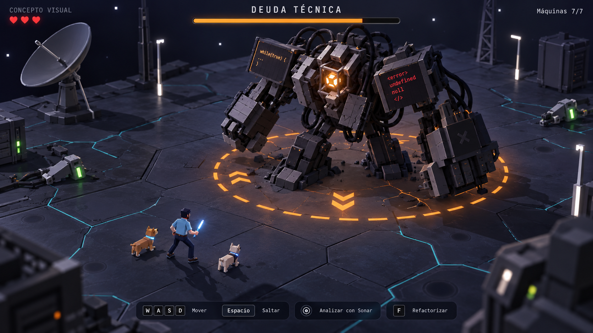

# Dirección visual: Deuda técnica

Fecha: 2026-09-23. Estado: dirección visual aprobada por Christian («excelente me gusta mucho dale»); integración pendiente. Requisitos: R1, R2, R7, R10 y R11.



Imagen conceptual generada con la herramienta integrada `imagegen` a partir de la captura aportada por Christian. No es una captura del juego modificado, un modelo 3D ni evidencia de rendimiento. No se carga desde la aplicación.

## Qué trasladar al juego

- Cámara cercana que permita reconocer al desarrollador, sus compañeros y la amenaza.
- Criatura articulada de placas oscuras, cables, hombros asimétricos y núcleo ámbar.
- Iluminación que conserve el volumen de los objetos y concentre el brillo en indicadores útiles.
- Suelo de placas y vetas discretas; espacio libre alrededor del combate.
- Máquinas reparadas, progreso completo, vida del jefe y ataque anunciado mediante un anillo segmentado.

## Criterio de entrega aclarado por Christian

El 2026-09-23 Christian indica que esperaba ese aspecto en el juego y que seguir viendo los mismos personajes no satisface la petición. Esta imagen es la referencia de aceptación de R15. El trabajo no se cierra con cámara nueva, recoloración superficial ni otra ilustración: requiere modelos y escena ejecutables, comparados con la referencia y revisados en movimiento.

Además del jefe, verificar protagonista con camisa azul y cabello oscuro, rostro sin quemarse por la luz y dos compañeros diferenciados: perro ocre de mayor tamaño y perro crema de menor tamaño, ambos con collar cian. Registrar qué coincide y qué queda pendiente. La perspectiva oculta superficies posteriores: su geometría se reconstruye de forma coherente y se revisa desde otros ángulos; no se afirma que la imagen revele esas superficies.

La captura generada usa una perspectiva dramática y detalle ilustrativo. En la implementación se ajustarán encuadre y densidad al tamaño real del personaje, a la lectura de los ataques y al rendimiento de WebGL. La etiqueta «CONCEPTO VISUAL» es exclusiva de esta referencia. La vida, el progreso y las acciones del HUD deberán representar el estado real y cumplir R3/R7, incluida la identificación de Sonar como simulación local.

## Prompt exacto

```text
Use case: stylized-concept. Asset type: visual design proposal for an existing browser-based 3D action game. Edit the supplied screenshot into a polished art-direction concept for its final boss encounter. The screenshot is the edit target and establishes the existing game: a dark alien sci-fi platform, developer avatar, satellites, repaired bug turrets, cyan circuit-like floor veins, 3 hearts and keyboard/touch controls. Preserve that game's identity and oblique top-down gameplay view, but compose a closer, readable 16:9 frame with the full-body developer character at about 14% of image height in the lower-left foreground, two small dog companions nearby, and a final boss about 2.5 times his height opposite him in the midground. Show a stylized, deliberately geometric 3D monster made of graphite server blocks, asymmetrical armored shoulders, thick limbs, tangled black cables, broken code panels and a small controlled amber energy core in the chest. Menacing silhouette and weight, not a human robot or a kaiju. The player has short dark hair, light blue shirt and dark trousers. A few deactivated bug turrets in the periphery now have tiny green indicators. Ground plane with restrained fine cyan cracks and larger readable stone/metal panels, sparse readable props framing a clear combat space. Matte surfaces, bevelled edges, cool soft directional lighting, well-shaped shadows, subtle atmospheric depth. Amber attack warning ring with dashed outline and chevrons on ground under boss communicates an impending slam. Avoid huge white bloom, bright white props, blur, glossy toy aesthetic, excessive particles, ultra photoreal detail, impossibly dense geometry. High quality indie game 3D screenshot style that could be implemented in Three.js WebGL, not a painterly illustration or AAA cinematic. Minimal clean Spanish HUD: small uppercase 'CONCEPTO VISUAL' in top left alongside the hearts; centered boss name 'DEUDA TÉCNICA' above a thin amber health bar; compact upper-right objective 'Máquinas 7/7'; discreet lower controls 'WASD  Mover', 'Espacio  Saltar', 'Analizar con Sonar', 'F  Refactorizar'. Preserve legibility and generous UI margins. This is one single finished visual proposal, not a before-after comparison, not an actual shipped screenshot.
```

## Suelo del lector — 2026-09-23

Tras rechazar el suelo de metal se propusieron biblioteca en ruinas y laboratorio. Mientras no llega elección, se avanza con la opción recomendada de piedra: `public/textures/world/library-slate-v1.png`, generada mediante la herramienta integrada de imagegen, no CLI. Se integra como albedo en las losas 3D, con bump contenido y normales existentes suaves. Es una textura, no una captura del juego ni una imagen de fondo.

Prompt final: “Use case: stylized-concept. Asset type: seamless tileable diffuse/albedo texture for an actual 3D game floor material, 1024x1024 square. Primary request: an unlit flat overhead scan of premium weathered basalt/slate stone, fine tactile stone pores, mineral granularity, extremely subtle layered geological striations and small worn chips, charcoal blue-gray and warm gray variation at medium gray brightness so real-time game lighting can shade it. This is a single continuous stone material swatch covering the entire image. High quality hand-authored AAA stylized PBR game texture with subtle photoreal material detail. Constraints: no tiles, no paving seams, no giant cracks, no raised objects, no perspective, no camera depth of field, no lights or shadows baked into texture, no glowing areas, no symbols or text or border, no people. Edges must tile seamlessly. Surface should not be uniformly smooth or noisy static; use coherent natural slate forms, restrained broad color variation and readable fine detail.”
